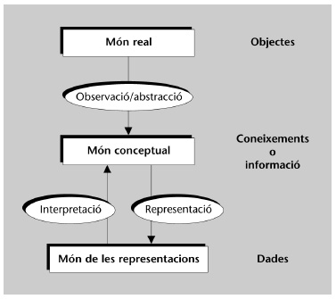
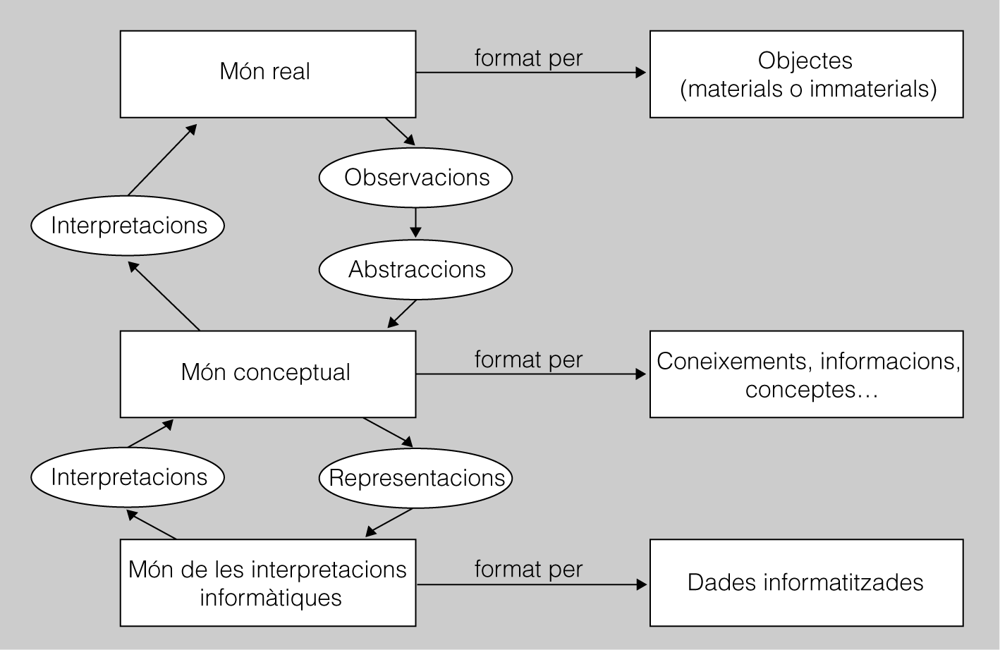

# Introducció a les bases de dades

Actualment estem absolutament envoltats de informació la qual, en el **99%** de les vegades esta emmagatzemada en una base de dades.

Exemples diaris en que creieu que hi ha informació emmagatzemada en una base de dades.
1. Treure calers d'un caixer automàtic.
1. ...

Per tant, com a tècnics superiors en informàtica, cal que tingui molt clars un seguit de conceptes relacionats amb les dades i de la seva representació informàtica.

Per començar cal entendre que hi ha tres àmbits que hem de ser capaços de diferenciar per tal de treballar correctament amb les dades: el món real, el món conceptual i el món de les representacions.

Per **món real**, s'entén la part de la realitat (ja sigui tangible o intangible) que en un moment determinat ens interessa informatitzar perquè hem rebut un encàrrec en aquest sentit. 
Així doncs, mitjançant l'observació de la realitat, s'obté un conjunt d'abstraccions de les informacions considerades rellevants, es construeix un **model que conceptualitza** els aspectes de la realitat amb els quals volem treballar. Finalment, cal implementar alguna **representació informàtica** concreta dels conceptes abstrets durant la fase anterior, per tal de poder-hi treballar fent servir les tecnologies que ens ofereixen les bases de dades i, també, els seus sistemes gestors.

## Introducció a les bases de dades i als sistemes gestors de bases de dades

### 1.1 Les dades i les bases de dades

Tot informàtic que hagi de treballar amb bases de dades (BD), és imprescindible que sàpiga distingir tres àmbits ben diferenciats, però que al mateix temps estan fortament interrelacionats, els quals fan referència, respectivament, a **la realitat**, a la seva **conceptualització**, i a la seva **representació informàtica**.

1. El **món real**. Està constituït pels **objectes (materials o immaterials) de la realitat que ens interessen** i amb els quals haurem de **treballar**.
1. El **món conceptual**. És el **conjunt de coneixements o informacions** obtinguts gràcies a l’observació de la part del *món real* que ens interessa. Un mateix *món real pot donar lloc a diferents mons conceptuals, en funció de la manera de percebre la realitat, o els interessos de l’observador d’aquesta* .
1. El **món de les representacions**. Està format per les **representacions informàtiques, o dades, del món conceptual, necessàries per poder treballar**.

[Figura 1.1: **Els tres móns** *Versió A*](images/10000000000001790000014FB39443DC.png "Figura 1.1. Els tres móns **Ver. A**")

[Figura 1. 1. **Els tres móns** *Versió B*](images/ic10m2u1_01.png "Figura 1.1. Els tres móns **Ver. B**")

### 1.1.1 Les dades i la seva representació
Un cop estructurats, els conceptes entorn de la realitat passen a ser veritables informacions, amb les quals els humans ens podem comunicar i començar a treballar.
Però encara cal donar un altre pas que ens permeti representar aquestes informacions, de tal manera que les puguem tractar informàticament mitjançant BD i aplicacions, i aprofitem així tot el potencial de les noves tecnologies.

Les **dades** són representacions informàtiques de la informació disponible, relativa als objectes del món real del nostre interès.
El **món de les representacions** està format per les dades informatitzades amb les quals treballem.

Ara bé, la conversió de les concepcions en dades no és automàtica, ni de molt.
Requereix passar per dues fases successives de disseny, en què es prenen decisions que poden derivar en resultats dispars. Aquestes dues fases de disseny són les següents:
1. Fase de disseny lògic. Es treballa amb el model abstracte de dades obtingut al final de l’etapa de disseny conceptual, per tal de traduir-ho al model de dades utilitzat pel SGBD amb el qual es vol implementar i mantenir la futura BD.
1. Fase de disseny físic. Es poden fer certes modificacions sobre l’esquema lògic obtingut en la fase de disseny anterior, per tal d’incrementar l’eficiència en algunes de les operacions que s’hagin de fer amb les dades.
Per tant, cal ser conscients que, en un mateix conjunt de coneixements entorn d’una mateixa realitat, aquests es poden representar de maneres diferents a causa, per exemple, dels factors següents:
     Les decisions de disseny preses (tant a nivell conceptual, com a nivell lògic i físic).
     La tecnologia emprada (fitxers, BD relacionals, BD distribuïdes, etc.).
La possibilitat que hi hagi aquestes diferències no implica que tots els resultats es puguin considerar equivalents, sense més ni més, ja que, normalment, les representacions diferents donen lloc a nivells d’eficiència també diferents. Aquest fet pot tenir conseqüències importants, ja que la responsabilitat de tot informàtic inclou garantir la correcció de les representacions, però també l’eficiència de les implementacions.

